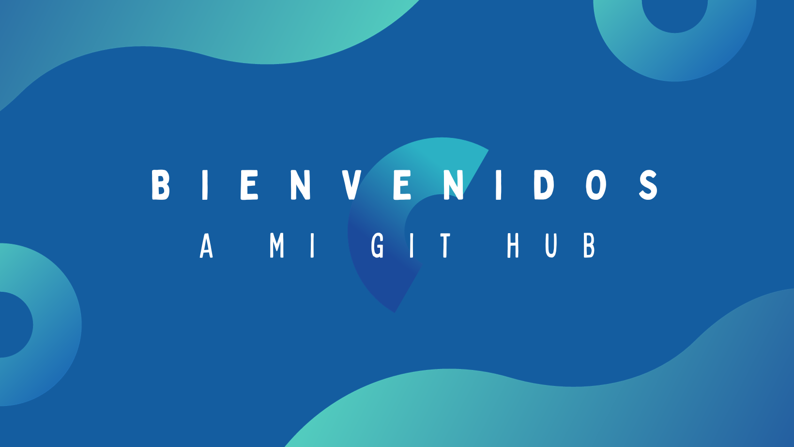

 

<strong>&nbsp;</strong><strong>&nbsp;</strong>

<strong>Mi nombre es Lucia, y estos son  algunos datos de mi persona:&nbsp;</strong><strong>&nbsp; &nbsp; &nbsp;</strong> &nbsp;

📖:

<ul>
    <li>Tecnicatura en Programacion en FRSR💻</li>
    <li>Testing Manual/ Automatization 🔍Macros,Power Bi, MYSQL 📊📈 &nbsp; &nbsp; &nbsp; &nbsp; &nbsp; &nbsp; &nbsp; &nbsp; &nbsp; &nbsp; &nbsp; &nbsp; &nbsp;&nbsp;</li>
</ul>

👷:&nbsp;

<ul>
    <li>Ingeniera Industrial-FRSR👩&zwj;💻</li>
    <li>Funcional testing &nbsp;🕵️&zwj;♀️ </li>
</ul>

🌍: Cordoba,Argentina.📌

🔛:

<ul>
    <li>&nbsp;running 🏃&zwj;♀️</li>
    <li>&nbsp;music🎶</li>
</ul>

Actualmente me encuentro contribuyendo en dos proyectos:&nbsp;

<ul>
    <li>&nbsp;Gamesit:&nbsp;&nbsp;una plataforma de juegos que te recuerdan las &eacute;pocas de los 90 s. Interactivos, practico, justo para esos momentos que queres desconectar por 5 min. Mas info 👇️</li>
    <li>Tu mesetas: En este caso testeando una pagina que ser&aacute; ** revoluci&oacute;n a la hora de cargar datos y en este caso para las aseguradoras de autos 🚗</li>
</ul>

 

<h3 align="center">&nbsp;Pueden contactarse conmigo:</h3>

<h3 align="center">Lenguajes y Herramientas:</h3>

&nbsp; &nbsp;     &nbsp;

 

 

 

Prueba Word to HTML - <a href="https://wordtohtml.net/site/payment">p&aacute;sate a PRO</a>.

